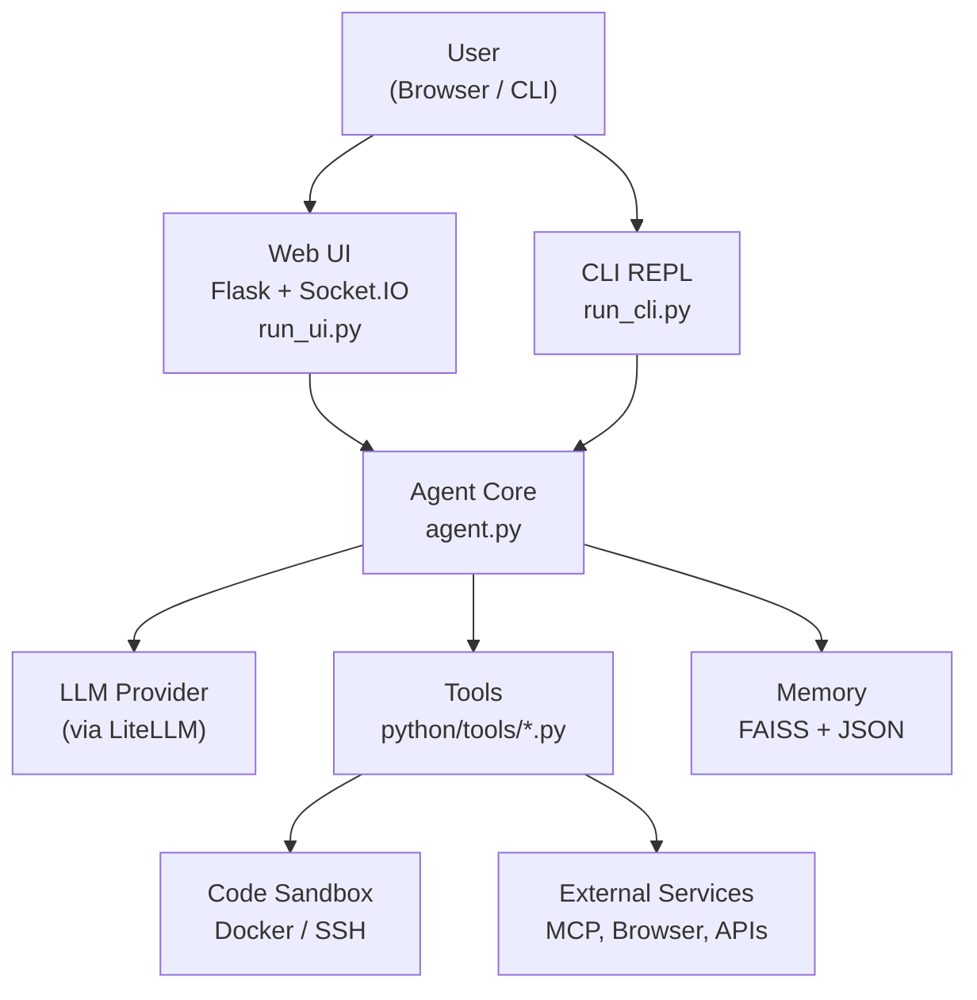
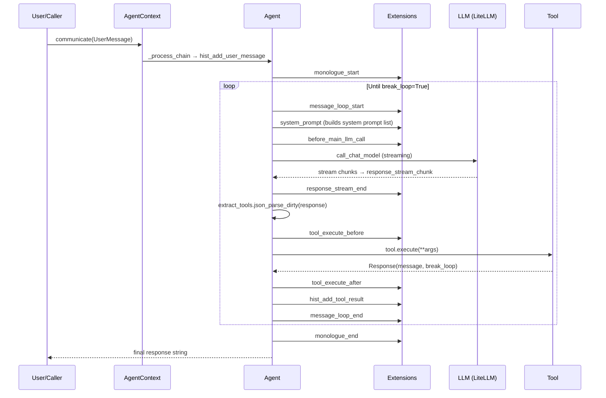

# Project Architecture Blueprint — Agent Zero

> Generated: March 23, 2026. Keep this document updated as the architecture evolves.

---

## 1. Architecture Detection and Analysis

**Detected Technology Stack:**
- **Language:** Python 3.12+, full `asyncio` / `async-await` throughout
- **LLM abstraction:** LiteLLM (100+ provider support) wrapped in a custom `SimpleChatModel` subclass (`models.py`)
- **LangChain usage:** Prompt templating and history (LangChain Core), FAISS vector store (LangChain Community)
- **Web layer:** Flask (sync routes) bridged to ASGI via WSGI middleware; `python-socketio` / `uvicorn` for WebSocket
- **Packaging:** `pip` + `requirements.txt`; no build system (no Makefile, pyproject.toml, or setup.py)

**Detected Architectural Pattern:**
Agent Zero is a **Plugin-Driven Event Loop** architecture. The core loop (`Agent.monologue`) is dependency-free; all feature variation is injected through two orthogonal extension mechanisms: **Tools** (action execution, auto-discovered) and **Extensions** (lifecycle hooks, auto-discovered, sorted by filename prefix). This is closest to a **Pipes-and-Filters + Plugin** pattern applied to an agentic loop.

---

## 2. Architectural Overview

The guiding principle is **zero-registration extensibility**: dropping a file into the correct folder is sufficient to add a new tool, hook, agent profile, skill, or API endpoint. No central registry exists.

**Core boundaries:**

| Boundary | Enforces |
|---|---|
| `python/tools/` vs `python/helpers/` | Tools are LLM-callable actions; helpers are internal utilities |
| `python/extensions/<point>/` | Lifecycle injection without touching `agent.py` |
| `python/api/` | HTTP REST surface; each endpoint is a standalone file |
| `agents/<name>/` | Agent personality / profile; isolated from code |
| `prompts/` | All LLM-visible text; no strings hard-coded in Python |
| `skills/` / `usr/skills/` | Portable, portable reusable blocks for agents |

All LLM text is externalised to `prompts/*.md` files and read via `Agent.read_prompt()`, enabling textual changes without code deployments.

---

## 3. Architecture Visualization

### 3.1 High-Level System Context (C4 Level 1)



### 3.2 Monologue Loop Data Flow (C4 Level 3)



### 3.3 Component Map

```
agent-zero/
├── agent.py                  ← AgentContext, Agent, AgentConfig, LoopData, UserMessage
├── initialize.py             ← AgentConfig factory (reads settings → builds ModelConfig objects)
├── models.py                 ← ModelConfig, LiteLLM-backed SimpleChatModel, Embeddings
├── run_ui.py                 ← Flask + uvicorn + Socket.IO bootstrap
├── run_cli.py                ← CLI REPL
│
├── python/
│   ├── tools/                ← Auto-discovered Tool subclasses (one per file)
│   ├── extensions/<point>/   ← Auto-discovered Extension subclasses, sorted by filename
│   ├── api/                  ← Auto-discovered ApiHandler subclasses (one per file)
│   ├── websocket_handlers/   ← Auto-discovered WebSocketHandler subclasses
│   └── helpers/
│       ├── tool.py           ← Tool base class + Response dataclass
│       ├── extension.py      ← Extension base + call_extensions()
│       ├── memory.py         ← FAISS Memory + Area enum
│       ├── history.py        ← In-context window with topic compression
│       ├── settings.py       ← Runtime settings (A0_SET_* env vars)
│       ├── subagents.py      ← Agent profile discovery (agents/ + usr/agents/)
│       ├── skills.py         ← Skill discovery and loading (SKILL.md standard)
│       ├── projects.py       ← Git-backed project workspaces (usr/projects/)
│       ├── task_scheduler.py ← Cron + ad-hoc task runner
│       └── mcp_handler.py    ← MCP client (Stdio, SSE, HTTP transports)
│
├── agents/<name>/            ← Agent profiles (agent.json + optional prompt overrides)
├── prompts/                  ← All LLM-visible text (Jinja2-like interpolation)
├── skills/                   ← Built-in skills (SKILL.md standard)
└── usr/                      ← User overrides (skills, agents, extensions, knowledge)
```

---

## 4. Core Architectural Components

### 4.1 `agent.py` — Core Runtime

**Purpose:** The heart of the framework. Contains three closely related classes:

| Class | Responsibility |
|---|---|
| `AgentContext` | Thread-safe session container. Owns the `DeferredTask`, log, and the root `Agent`. Manages the `_process_chain` call stack so subordinate chains bubble results back correctly even after hot-reload. |
| `Agent` | Stateful actor. Runs `monologue()`: builds prompt, calls LLM, parses JSON, dispatches tool, repeats. Holds `history`, `data` dict, and current `intervention`. |
| `AgentConfig` | Frozen dataclass created by `initialize.py`. Holds all four `ModelConfig` objects (chat, utility, embedding, browser) and SSH/Docker code-exec parameters. |

**Key patterns:**
- `Agent.data` is a free `dict` shared between the agent and all its tools — the only mutable state across iterations.
- `agent.read_prompt(name, **vars)` loads from `prompts/` with overlay search order: project → user → agent profile → default.

### 4.2 `python/tools/` — Action Execution Layer

Every `.py` file in this folder is auto-discovered and instantiated on demand. Convention: **one class per file**; the class name does not need to match the file name (discovery uses the `Tool` base class, not naming).

```python
# python/tools/my_tool.py
from python.helpers.tool import Tool, Response

class MyTool(Tool):
    async def execute(self, param1="", **kwargs) -> Response:
        result = do_work(param1)
        return Response(message=result, break_loop=False)
```

`before_execution` / `after_execution` hooks in `Tool` base handle logging automatically — overriding them is rarely needed.

### 4.3 `python/extensions/` — Lifecycle Hooks

Each sub-folder is an **extension point**. Files within are sorted lexicographically by filename prefix (`_10_`, `_20_`, …) so ordering is explicit and predictable.

```python
# python/extensions/message_loop_start/_30_my_hook.py
from python.helpers.extension import Extension

class MyHook(Extension):
    async def execute(self, loop_data=None, **kwargs):
        loop_data.system.append("extra context")
```

Override by creating the **same filename** in `usr/extensions/<point>/` — the user file shadows the built-in one.

### 4.4 `python/api/` — REST API Layer

Each file is a standalone `ApiHandler` subclass, auto-discovered and auto-registered. The URL path is derived from the filename. Authentication and CSRF checks are declared via `requires_auth()` / `requires_csrf()` class methods.

### 4.5 `python/helpers/memory.py` — Vector Memory

FAISS-backed persistent memory, scoped per agent (`memory_subdir`). Three logical areas driven by metadata:

| Area | Purpose |
|---|---|
| `MAIN` | General knowledge, solutions, facts |
| `FRAGMENTS` | Compressed conversation fragments |
| `SOLUTIONS` | Reusable solution templates |

Access pattern: always `async` — `db = await Memory.get(agent)`.

### 4.6 `python/helpers/history.py` — In-Context Window

A multi-tier compression system that keeps the conversation within the model's context window. Messages form **topics**; topics are compressed into summaries when token budget is exceeded. Constants like `CURRENT_TOPIC_RATIO` control the budget split across tiers.

### 4.7 `python/helpers/mcp_handler.py` — MCP Client

Connects to Model Context Protocol servers via Stdio, SSE, or Streamable HTTP. Tools from MCP servers are surfaced to the agent at system-prompt build time via `get_tools_prompt()`. Configuration lives in settings under `mcp_servers` (JSON string).

### 4.8 `models.py` — LLM Abstraction

A thin LangChain `SimpleChatModel` subclass that delegates to **LiteLLM**. This means any of LiteLLM's 100+ providers work by changing `provider` + `name` in settings, with no code changes.

---

## 5. Architectural Layers and Dependency Rules

```
┌────────────────────────────────────────────────┐
│           Web / CLI Entry Points               │  run_ui.py, run_cli.py
├────────────────────────────────────────────────┤
│           API / WebSocket Handlers             │  python/api/, python/websocket_handlers/
├────────────────────────────────────────────────┤
│               Agent Core                       │  agent.py  ←  initialize.py
├────────────────────────────────────────────────┤
│      Extensions          │       Tools         │  python/extensions/, python/tools/
├────────────────────────────────────────────────┤
│                   Helpers                      │  python/helpers/
├────────────────────────────────────────────────┤
│       Models / LLM         │   Memory / FS     │  models.py, FAISS, JSON files
└────────────────────────────────────────────────┘
```

**Dependency rules:**
- Entry points → AgentCore → Helpers → Models (downward only)
- Tools and Extensions import from `agent.py` and `python/helpers/` — they must **not** import from `python/api/` or `run_ui.py`
- `agent.py` does **not** import any individual tool or extension — discovery happens at runtime via `load_classes_from_folder()`
- Circular: `agent.py` ↔ `models.py` is the one necessary cycle (Agent needs ModelConfig; models imports nothing from agent)

---

## 6. Data Architecture

### Settings & Configuration

All configuration flows through a single pipeline:
```
.env (A0_SET_* prefix)  →  settings.get_settings()  →  initialize_agent()  →  AgentConfig
```

Sensitive values (API keys, passwords) are stored in `.env` only — never in source files 

### Prompt Templates

Prompts live in `prompts/*.md` and use `{{ include "..." }}` directives (custom Jinja-like loader in `Agent.read_prompt()`). Overlay order: project → usr/agents → agents → prompts (first-found wins).

### Persistent State Files

| Path | Format | Owner |
|---|---|---|
| `memory/<subdir>/` | FAISS index + JSON docstore | `Memory` helper |
| `usr/scheduler/` | JSON task files | `TaskScheduler` |
| `logs/` | Log files | `Log` helper |
| `usr/projects/<name>/.a0proj/` | JSON project metadata | `projects.py` |

---

## 7. Cross-Cutting Concerns

### Authentication & Authorization
- Optional basic auth: `AUTH_LOGIN` / `AUTH_PASSWORD` in `.env` — credentials checked via SHA-256 hash in `python/helpers/login.py`
- CSRF protection: token per session, verified by `ApiHandler` and `WebSocketHandler` base classes via `requires_csrf()` override
- No RBAC — single-user model by design

### Error Handling & Resilience
- `InterventionException` — skips current iteration (user paused); caught inside the monologue loop
- `HandledException` — non-recoverable; terminates the monologue
- `RepairableException` — triggers retry logic with LLM self-correction (up to `error_retries` limit)
- All tool errors are returned as human-readable messages to the agent, which attempts self-correction

### Logging & Observability
- `python/helpers/print_style.py` — coloured terminal output using ANSI codes; used throughout for agent activity visibility
- `python/helpers/log.py` — structured in-memory log attached to each `AgentContext`; polled by the web UI via `/api/log_get`

### Security (File I/O)
- `python/helpers/security.py` — `safe_filename()` strips path traversal characters, Windows reserved names, and truncates at 255 chars. Applied to all user-supplied filenames.

### Configuration Management
- Settings loaded from `.env` via `python/helpers/dotenv.py` with `A0_SET_` prefix
- `settings.get_settings()` provides typed defaults; `settings.merge_settings()` handles partial overrides
- No feature flags — behaviour controlled by prompt profiles and extension presence

---

## 8. Service Communication Patterns

| Pattern | Implementation |
|---|---|
| Agent → LLM | Sync streaming via LiteLLM `acompletion` |
| Agent → Sub-agent | Direct Python call via `call_subordinate` tool; shares same `AgentContext` |
| Agent → Code Sandbox | SSH (`paramiko`) into Docker container; local fallback via `pexpect` |
| Agent → MCP servers | Stdio subprocess, SSE, or Streamable HTTP via `mcp` SDK |
| Agent → Browser | `playwright` via `browser-use` library |
| Web UI → Agent | Socket.IO over ASGI (uvicorn → Flask WSGI bridge) |
| REST API | Flask routes, one handler per `python/api/*.py` file |

Agent-to-agent communication is synchronous and hierarchical (superior/subordinate tree), not message-bus — the subordinate's final `Response` is returned directly to the superior.

---

## 9. Python-Specific Architectural Patterns

- **`asyncio` throughout** — all I/O is `async`. `nest_asyncio.apply()` at top of `agent.py` allows calling `asyncio.run()` inside an already-running loop (needed for CLI / Jupyter compatibility).
- **`dataclass` for value objects** — `AgentConfig`, `ModelConfig`, `UserMessage`, `LoopData` are dataclasses; immutable by convention.
- **`Enum` for closed sets** — `Memory.Area`, `ModelType`, `AgentContextType`, `TaskState`, `TaskType` prevent magic strings.
- **`Pydantic` at boundaries** — external data (MCP config, SubAgent metadata, Task models, Project data) uses Pydantic v2 models with `model_validator` for cross-field logic.
- **No ORM** — persistence is FAISS + plain JSON files. No database.
- **Deferred execution** — `python/helpers/defer.py` wraps `threading.Thread` to run async coroutines from sync contexts without blocking the main thread.

---

## 10. Implementation Patterns

### Tool Interface

```python
class MyTool(Tool):
    async def execute(self, arg1: str = "", arg2: str = "", **kwargs) -> Response:
        # self.agent  — current agent
        # self.args   — raw args dict from LLM
        # self.agent.context.log — structured logging
        return Response(message="result text", break_loop=False)
```

Companion prompt file `prompts/agent.system.tool.my_tool.md` must describe the tool name, purpose, and usage examples in a format consistent with `agent.system.tool.code_exe.md`.

### Extension Interface

```python
class MyExtension(Extension):
    async def execute(self, loop_data: LoopData = LoopData(), **kwargs) -> None:
        # Mutate loop_data.system (list[str]) to inject system prompt fragments
        # Mutate loop_data.extras_temporary / extras_persistent for per-turn context
        loop_data.system.append(self.agent.read_prompt("my_context.md"))
```

### Agent Profile

```json
// agents/my_specialist/agent.json
{
  "title": "My Specialist",
  "description": "Used by call_subordinate tool to pick this profile.",
  "context": "You are specialised in X. Focus only on X tasks."
}
```

Any prompt file placed in `agents/my_specialist/` overrides the default `prompts/` equivalent for that agent.

### API Endpoint

```python
# python/api/my_endpoint.py
from python.helpers.api import ApiHandler
from flask import request, Response

class MyEndpoint(ApiHandler):
    async def process(self, input: dict, request: Request) -> dict | Response:
        return {"result": "ok"}
```

Auto-registered at `/api/my_endpoint` (filename → URL, underscores → hyphens optional).

---

## 11. Testing Architecture

No test files are present in the root repo (`.test.py` files are git-ignored). The framework favours direct interactive testing via CLI (`run_cli.py`) and the web UI. Recommended testing approach when adding features:

- **Unit** — test `Tool.execute()` and `Extension.execute()` independently; mock `self.agent` with a minimal stub
- **Integration** — spin up a real `AgentContext` with a mocked LLM (LiteLLM supports `custom_llm_provider="test"`)
- **System** — use `run_cli.py` with a cheap model (e.g. `gpt-4o-mini`) for end-to-end validation

---

## 12. Deployment Architecture

### Local Development
```bash
pip install -r requirements.txt
# Copy example.env → .env, set API keys
python run_ui.py        # Web UI at http://localhost:50001
python run_cli.py       # CLI
```

### Docker (Recommended)
```bash
docker pull agent0ai/agent-zero
docker run -p 50001:80 \
  -e A0_SET_chat_model_name=gpt-4o \
  -e OPENAI_API_KEY=sk-... \
  agent0ai/agent-zero
```

The Docker image bundles an SSH server (`port 55022`) so code execution runs in an isolated sandbox. `AgentConfig.code_exec_ssh_*` fields control the target.

### Configuration via Environment
All settings override via `A0_SET_<setting_name>` environment variables (see `python/helpers/settings.py` for full list). No config files need to be baked into images.

---

## 13. Extension and Evolution Patterns

### Adding a New Feature (Decision Tree)

```
New LLM-callable action?
  → Add python/tools/<name>.py + prompts/agent.system.tool.<name>.md

Need to inject context into every prompt?
  → Add python/extensions/system_prompt/_NN_<name>.py

Need to run logic before/after tool execution?
  → Add python/extensions/tool_execute_before/_NN_<name>.py

New REST endpoint?
  → Add python/api/<name>.py

New specialised agent personality?
  → Add agents/<name>/agent.json

Reusable agent capability across projects?
  → Add skills/<name>/SKILL.md

User-level override of built-in extension?
  → Create usr/extensions/<point>/<same-filename>.py
```

### Deprecation / Replacement
- Shadow old extension with a user-space file of the same name that is a no-op
- Never edit `python/extensions/` directly if the change is project-specific

### Integration Patterns
- **New LLM provider:** Change `chat_model_provider` setting; LiteLLM handles the rest
- **New external API:** Create a Tool that calls the API; optionally wrap in a helper in `python/helpers/`
- **New MCP server:** Add JSON config to the `mcp_servers` setting string

---

## 14. Architectural Pattern Examples

### Layer Separation — System Prompt Assembly
The system prompt is never built in `agent.py`. Extensions in `python/extensions/system_prompt/` each append fragments:

```python
# _10_system_prompt.py — core prompt
system_prompt.append(agent.read_prompt("agent.system.main.md"))
system_prompt.append(get_tools_prompt(agent))

# _20_behaviour_prompt.py — behaviour rules (separate concern)
system_prompt.append(agent.read_prompt("agent.system.behaviour.md"))
```

The agent just calls `await call_extensions("system_prompt", system_prompt=loop_data.system)` — it has no knowledge of what each extension adds.

### Sub-Agent Delegation
```python
# LLM outputs this JSON:
{
  "tool_name": "call_subordinate",
  "tool_args": {
    "message": "Research the top 5 Python async patterns",
    "profile": "researcher",
    "reset": "false"
  }
}
# call_subordinate.py:
#   1. Reads profile from agents/researcher/agent.json
#   2. Creates sub = Agent(self.agent.number + 1, config, self.agent.context)
#   3. Links superior/subordinate via agent.data dicts
#   4. Runs sub.monologue() and returns result
```

### Tool Auto-Discovery
```python
# python/helpers/extract_tools.py
def load_classes_from_folder(folder: str, base_class: type) -> list[type]:
    # Scans *.py files, imports modules, finds subclasses of base_class
    # Returns list sorted by filename
```
Called once per tool invocation — no startup registration cost.

---

## 15. Architectural Decision Records

### ADR-001: Zero-Registration Plugin Architecture
**Context:** Needed to allow non-developers to add tools and behavioural rules without understanding Python imports or registries.
**Decision:** File presence = registration. `extract_tools.load_classes_from_folder()` discovers all subclasses at runtime.
**Consequences:** (✅) Minimal friction to extend; (⚠️) naming conflicts possible if two files define a class with the same `tool_name`; (⚠️) no IDE auto-complete for tool inventory.

### ADR-002: LiteLLM as Universal LLM Adapter
**Context:** Needed to support 100+ LLM providers without per-provider code.
**Decision:** Wrap LiteLLM's `acompletion` in a LangChain `SimpleChatModel` subclass (`models.py`).
**Consequences:** (✅) Provider swap = config change; (⚠️) LiteLLM version pinning is critical as API changes propagate; rate-limiter logic lives in `python/helpers/rate_limiter.py`.

### ADR-003: All Prompts Externalised to `prompts/`
**Context:** LLM behaviour needed to be tunable without code changes.
**Decision:** `agent.read_prompt(name, **vars)` with an overlay search path (project → user → profile → default).
**Consequences:** (✅) Non-technical users can tune agent behaviour; (✅) agent profiles trivially override individual prompt fragments; (⚠️) prompt regressions are harder to catch in CI.

### ADR-004: FAISS for Persistent Memory
**Context:** Needed semantic similarity search for memory retrieval; wanted no external database dependency.
**Decision:** FAISS (CPU) with a LangChain docstore JSON persistence layer.
**Consequences:** (✅) Zero infra; (⚠️) not suitable for multi-process deployments; (⚠️) requires ARM monkey-patch (`faiss_monkey_patch.py`) on Python 3.12+.

### ADR-005: Conversation History Compression
**Context:** Long conversations exceed LLM context windows.
**Decision:** Multi-tier compression in `python/helpers/history.py` — current topic → historical topics → bulk. Ratios tunable via constants.
**Consequences:** (✅) Transparently keeps agent running indefinitely; (⚠️) compressed older turns lose detail.

---

## 16. Architecture Governance

- **No tests in repo root** — `.test.py` is git-ignored; testing relies on interactive CLI/UI runs
- **`usr/` directory** — all user customisations isolated here; `.gitignore` excludes it from version control, preventing accidental commits of sensitive data
- **`data/` directory** — runtime data (FAISS indices, scheduler state) — excluded from the repo
- **Additive-only rule** — the codebase convention (documented in `.github/copilot-instructions.md`) prohibits breaking existing behaviour; all new code is additive

---

## 17. Blueprint for New Development

### Feature Addition Sequence

1. **Define the LLM interface** — write `prompts/agent.system.tool.<name>.md` first (what will the agent call and with what args?)
2. **Implement the tool** — create `python/tools/<name>.py` extending `Tool`
3. **Test interactively** — run `python run_cli.py`, ask the agent to use the tool
4. **Add lifecycle hooks** — only if needed; place in `python/extensions/<point>/`
5. **Persist results** — use `Memory.get(agent)` for semantic storage, or plain JSON for structured data

### Standard File Organisation for a New Tool

```
python/tools/my_feature_tool.py           ← Tool class
prompts/agent.system.tool.my_feature.md   ← Tool description for LLM
python/helpers/my_feature.py              ← Optional: shared logic (if >1 context)
```

### Common Pitfalls

| Pitfall | Correct Approach |
|---|---|
| Importing from `run_ui.py` inside a tool | Tools must be UI-agnostic; use `Agent.context.log` for output |
| Adding `break_loop=True` to intermediate tools | Only the final `response` tool should break the loop |
| Hardcoding model names in tools | Read from `self.agent.config.chat_model` |
| Editing `python/extensions/` for project overrides | Use `usr/extensions/` instead |
| Using `asyncio.run()` inside a tool | Use `await` — you are already inside an async context |
| Storing session state in module globals | Use `agent.data` dict or `AgentContext.set_data()` |

### Documentation Requirements for New Tools

Every tool needs:
1. A `prompts/agent.system.tool.<name>.md` with: description, when to use, argument names and types, at least one JSON example call
2. The `Response.message` should be a human-readable summary the agent can reason about — not a raw dict

---

*Blueprint generated from codebase analysis on 2026-03-23. Re-run the `architecture-blueprint-generator` prompt after significant structural changes.*
